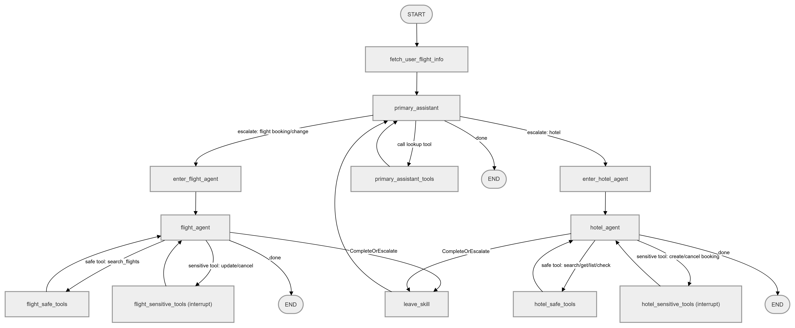

# LAT Airlines – Multi-Agent Customer Support System

A LAT Airlines customer support chatbot built on **LangGraph**, using a **multi-agent (supervisor / specialist)** architecture. A Primary Assistant acts as the orchestrator, silently delegating specialized tasks (booking/updating/cancelling flights, booking/cancelling hotels) to the appropriate sub-agent — without the user ever noticing that a handoff is happening.

## Table of Contents

- [Architecture Overview](#architecture-overview)
- [Graph Flow](#graph-flow)
- [Agents](#agents)
- [State Management](#state-management)
- [Delegation & Handoff Mechanism (Dialog Stack)](#delegation--handoff-mechanism-dialog-stack)
- [Human-in-the-Loop for Sensitive Actions](#human-in-the-loop-for-sensitive-actions)
- [Tool Error Fallback](#tool-error-fallback)
- [Memory & Persistence (Checkpointer / Store)](#memory--persistence-checkpointer--store)
- [Environment Requirements](#environment-requirements)

## Architecture Overview

The system consists of **3 core agents**, each being a pair of *(Prompt + LLM bound with tools)*:

| Agent | Role | Can create new bookings? |
|---|---|---|
| **Primary Assistant** | Answers general questions, looks up policy, searches flight/hotel info, and decides when to delegate to a specialist | No (orchestration only) |
| **Flight Agent** | Suggests flight schedules, updates, cancels existing tickets | No (only directs to the website for new bookings) |
| **Hotel Agent** | Searches hotels, views room details, checks room availability, creates/cancels hotel bookings | Yes (via `create_hotel_booking`) |

Each specialist agent has its own set of tools, split into two groups:

- **Safe tools**: read-only / lookup operations (search, lookup, list…) → executed immediately.
- **Sensitive tools**: operations that mutate real data (update, cancel, create booking…) → **interrupted** and held for confirmation before execution.

## Graph Flow



Notes:
- `fetch_user_flight_info` is the first node run after `START`; it pre-fetches the user's current flight info and injects it into each agent's system prompt.
- `enter_flight_agent` / `enter_hotel_agent` are **entry nodes**: they insert a "context handoff" `ToolMessage` before the specialist agent takes over, so it can understand the prior conversation without the user repeating themselves.
- The `leave_skill` node is how a sub-agent "returns control" to `primary_assistant` — when the task is done, the user changes their mind, or the request is out of scope.

## Agents

### 1. Primary Assistant (`primary_assistant`)

- **Prompt**: `primary_assistant_prompt`
- **Tools**: `lookup_airline_policy`, `get_all_user_bookings`, `search_flights`, `search_hotels`, `get_hotel_details`
- **Responsibilities**:
  - Answer general questions and look up airline policy.
  - Search/suggest flights and hotels (informational only — no booking/modification).
  - Only surface the new-booking link (`lat-airlines.com/book-flights`) when the context is about **flights** — never for hotel-related questions.
  - Only delegate (`ToFlightBookingAssistant` / `ToHotelBookingAssistant`) when the user **clearly expresses intent** to book/modify/cancel — not for pure information requests.

### 2. Flight Agent (`flight_agent`)

- **Prompt**: `flight_booking_prompt`
- **Safe tools**: `search_flights`
- **Sensitive tools**: `update_ticket_to_new_flight`, `cancel_ticket`
- **Key constraint**: **cannot create new bookings** — always redirects the customer to the website for new tickets.
- Calls `CompleteOrEscalate` to hand control back to the Primary Assistant when it can no longer help.

### 3. Hotel Agent (`hotel_agent`)

- **Prompt**: `hotel_booking_prompt`
- **Safe tools**: `search_hotels`, `get_hotel_details`, `list_hotel_room_types`, `get_user_hotel_bookings`, `list_available_room_types`, `check_room_type_availability`
- **Sensitive tools**: `create_hotel_booking`, `cancel_hotel_booking`
- **Standard workflow** (strictly enforced in the prompt):
  1. No hotel selected yet → suggest a list of hotels for the requested location.
  2. Hotel selected but dates missing → ask for check-in/check-out dates.
  3. Room type selected → **must** check availability (`check_room_type_availability`) before proceeding.
  4. Only book when the customer explicitly confirms and all details (dates, room type, availability) are valid.
  5. Never reveal actual room inventory counts — only respond at the level of "bookable" / "not bookable".

### Control-flow tools

These are not business-logic tools but **Pydantic schemas** used as routing signals for the graph, invoked by the LLM like ordinary tool calls:

- `ToFlightBookingAssistant` — request handoff to the Flight Agent.
- `ToHotelBookingAssistant` — request handoff to the Hotel Agent.
- `CompleteOrEscalate` — signals that a sub-agent has finished its task, or needs to escalate back to the Primary Assistant.

## State Management

The graph's state (`State`, a `TypedDict`) contains:

```python
class State(TypedDict):
    messages: Annotated[list[AnyMessage], add_messages]   # conversation history
    user_info: str                                         # current user's flight info
    dialog_state: Annotated[list[str], update_dialog_stack] # stack of active agents
```

`messages` uses LangGraph's `add_messages` reducer to append new messages automatically instead of overwriting.

## Delegation & Handoff Mechanism (Dialog Stack)

`dialog_state` is a **stack** of agent names (`"assistant"`, `"flight_agent"`, `"hotel_agent"`), updated via the `update_dialog_stack` function:

- When the Primary Assistant delegates → the specialist agent's name is **pushed** onto the stack.
- When a specialist agent calls `CompleteOrEscalate` → the `leave_skill` node **pops** the stack, returning control to the Primary Assistant.

This lets the system always know which agent is currently "holding the mic", while preserving the full conversation history across every handoff.

## Human-in-the-Loop for Sensitive Actions

The graph is compiled with:

```python
graph = builder.compile(
    checkpointer=checkpointer,
    store=redis_store,
    interrupt_before=["flight_sensitive_tools", "hotel_sensitive_tools"],
)
```

This means that whenever an agent is about to call a tool capable of **mutating real data** (changing/cancelling a ticket, creating/cancelling a hotel booking), the graph **pauses execution before running it**, waiting for confirmation from the application layer (e.g. re-prompting the user with "Are you sure you want to...?") before continuing.

## Tool Error Fallback

Every `ToolNode` is wrapped with `create_tool_node_with_fallback`, attaching a `handle_tool_error` fallback: if a tool raises an exception, instead of crashing the whole graph, the system returns a `ToolMessage` describing the error to the LLM, giving it a chance to correct its next tool call.

The `Assistant` wrapper class (used for every agent) also has a self-recovery mechanism: if the LLM returns an empty result (no tool call, no content), the system automatically re-prompts the LLM to ensure the user always gets an actual response.

## Memory & Persistence (Checkpointer / Store)

- **`RedisSaver`** (`langgraph.checkpoint.redis`): persists conversation state checkpoints per `thread_id`, allowing the graph to pause/resume (e.g. while waiting for confirmation on a sensitive action) and maintain multi-turn conversations.
- **`RedisStore`** (`langgraph.store.redis`): a long-term store shared across nodes/agents.

## Environment Requirements

- Python 3.10+
- Redis (used for both the checkpointer and the store)
- LLM backend: OpenAI (`get_openai_llm_model`) or local Ollama (`get_ollama_llm_model`), toggled via `settings.USE_LOCAL_LLM`
- Main libraries: `langgraph`, `langchain-core`, `pydantic`

---

> **Design note**: Users are never informed that they're being transferred between different assistants — all delegation happens "silently" through tool calls, so the interaction feels like talking to a **single**, unified assistant.
